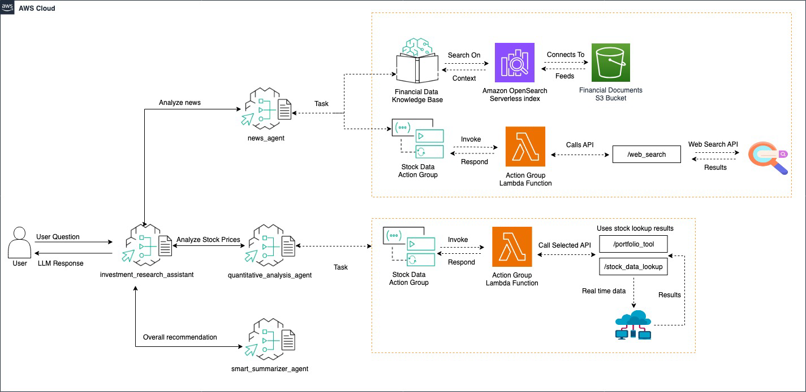

# Investment Research Assistant Agent

Investment Research supervisor agent has three collaborators, a News agent, a Quantitative Analysis Data agent, and a Smart Summarizer agent. These specialists are orchestrated to perform investment analysis for a given stock ticker based on the latest news and recent stock price movements.

## Architecture Diagram




## Prerequisites

1. Clone and install repository

```bash
git clone https://github.com/awslabs/amazon-bedrock-agent-samples

cd amazon-bedrock-agent-samples

python3 -m venv .venv

source .venv/bin/activate

pip3 install -r src/requirements.txt
```

2. Deploy Web Search tool

Follow instructions [here](/src/shared/web_search/).

3. Deploy Stock Data Lookup tool

Follow instructions [here](/src/shared/stock_data/).

4. Deploy Portfolio Optimization tool

Download files/agents-layer-porfolio.zip and upload it to an s3 bucket. Deploy files/s3-bda-s3.yaml in cloudformation and add the s3 bucket as an input parameter.

5. Set up and Deploy Bedrock Data Automation for Knowledge Bases

Set up an input bucket and output bucket in s3, then download files/invokedataautomationlambdalayer.zip and upload it to a seperate s3 bucket. Next, deploy files/s3-bda-s3.yaml and add the input bucket, output bucket, and s3 bucket where the .zip file is located as input parameters.

Keep track of the output bucket as this will be used as the data source for a knowledge base. Once the stack is deployed, add the following files to the input bucket.

- files/Amazon-10K-2022-EarningsReport.pdf
- files/Amazon-10Q-Q1-2023-QuaterlyEarningsReport.pdf
- files/Amazon-Quarterly-Earnings-Report-Q1-2023-Full-Call-v1.mp3
- files/Amazon_Q1_2024_10Q.pdf
- files/Amazon-Earnings-Call-Q1-2024-Full-Call-v1.mp3
- files/files/Amazon-Quarterly-Earnings-Report-Q4-2024-Full-Call-v1.mp3
- files/Amazon202410k.pdf

It may take up to 15 minutes for all the files to process and for results to show in the output bucket.


## Usage & Sample Prompts

### For main.py

1. Deploy Amazon Bedrock Agents

```bash
python3 examples/multi_agent_collaboration/portfolio_assistant_agent/main.py \
--recreate_agents "true"
--kb_s3_bucket "[name of output bucket]"
```

2. Invoke

```bash
python3 examples/multi_agent_collaboration/portfolio_assistant_agent/main.py \
--recreate_agents "false" \
--ticker "AMZN"
```

3. Cleanup

```bash
python3 examples/multi_agent_collaboration/portfolio_assistant_agent/main.py \
--clean_up "true"
```

### For main.ipynb

Run through the cells in the notebook

## License

This project is licensed under the Apache-2.0 License.
