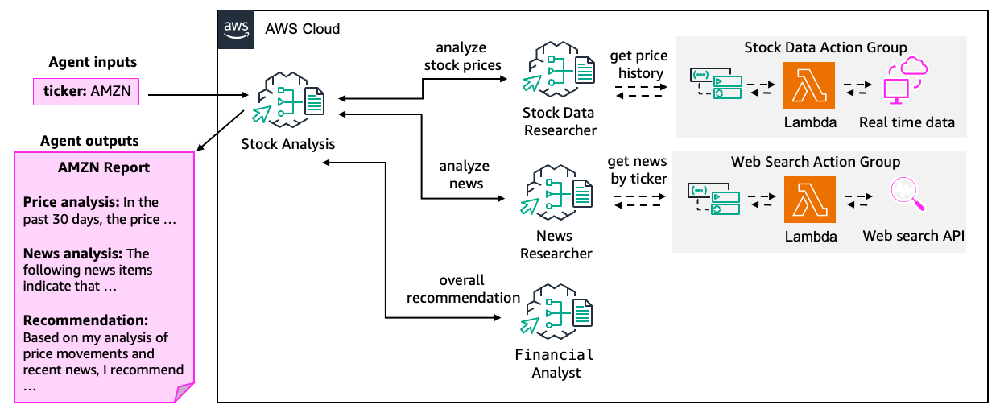

# Portfolio Assistant Agent

Stock Analysis supervisor agent has three collaborators, a News agent, a Stock Data agent, and a Financial Analyst agent. These specialists are orchestrated to perform investment analysis for a given stock ticker based on the latest news and recent stock price movements.

## Architecture Diagram



//to be updated

## Prerequisites

1. Clone and install repository

```bash
git clone https://github.com/awslabs/amazon-bedrock-agent-samples

cd amazon-bedrock-agent-samples

python3 -m venv .venv

source .venv/bin/activate

pip3 install -r src/requirements.txt
```

2. Deploy Web Search tool

Follow instructions [here](/src/shared/web_search/).

3. Deploy Stock Data Lookup tool

Follow instructions [here](/src/shared/stock_data/).

4. Deploy Comprehend Analysis tool

Deploy /src/shared/comprehend_analysis/cfn_stacks/sentiment_keyphrases_stack.yaml

5. Set up and Deploy Bedrock Data Automation for Knowledge Bases

Set up input bucket and output bucket (us-west-2), then download files/invokedataautomationlambdalayer.zip and upload it to an s3 bucket. Next, deploy files/s3-bda-s3.yaml and add the input bucket, output bucket, and .zip file arn as parameters

## Usage & Sample Prompts

1. Deploy Amazon Bedrock Agents

```bash
python3 examples/multi_agent_collaboration/portfolio_assistant_agent/main.py \
--recreate_agents "true"
```

2. Invoke

```bash
python3 examples/multi_agent_collaboration/portfolio_assistant_agent/main.py \
--recreate_agents "false" \
--ticker "AMZN"
```

3. Cleanup

```bash
python3 examples/multi_agent_collaboration/portfolio_assistant_agent/main.py \
--clean_up "true"
```


## License

This project is licensed under the Apache-2.0 License.
